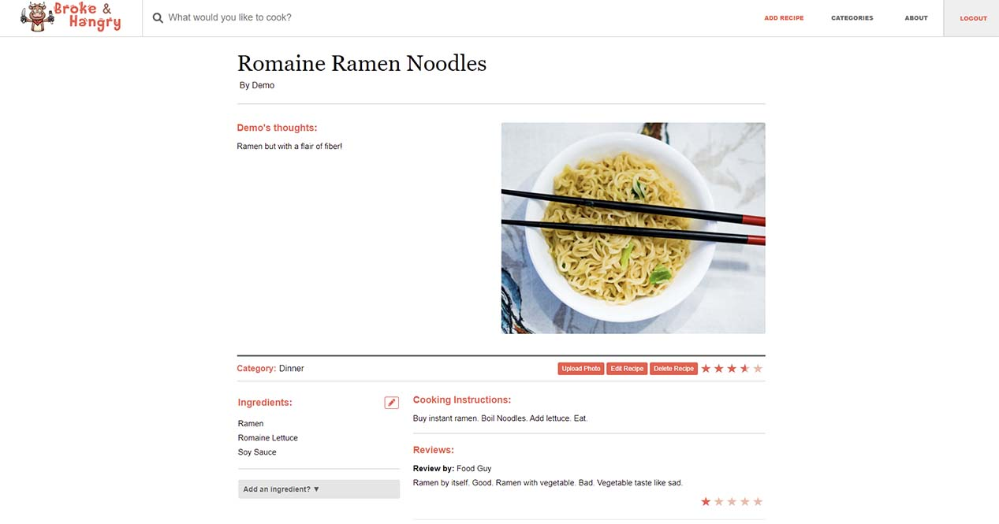
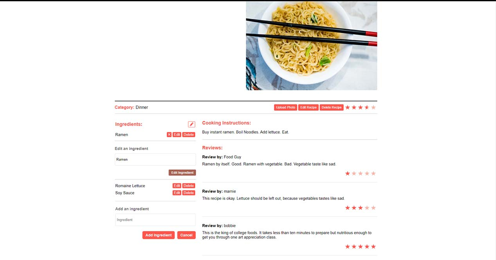
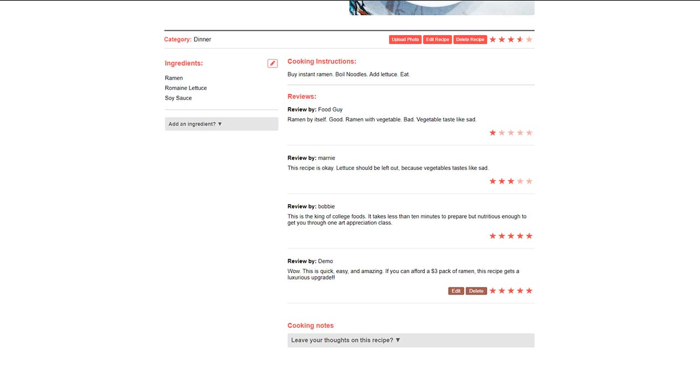
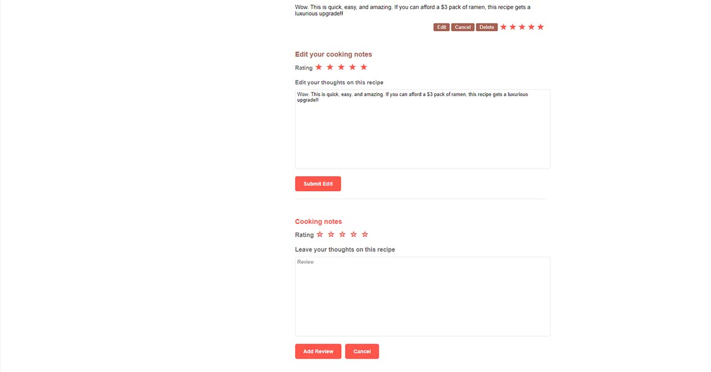
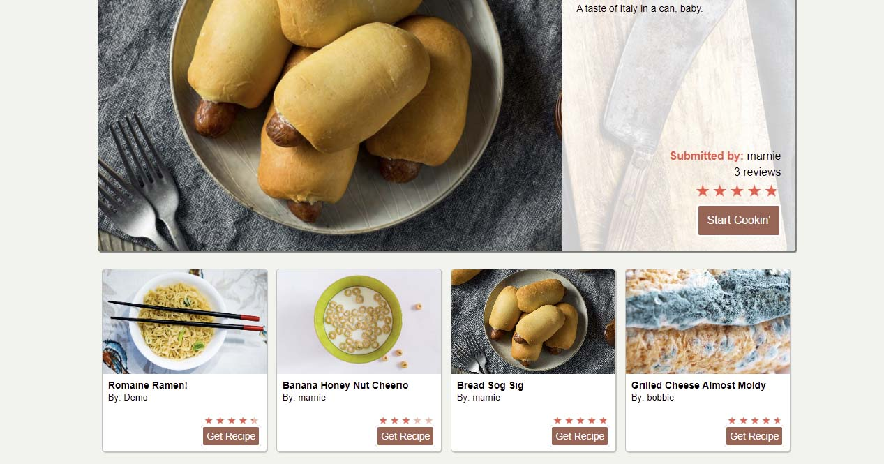
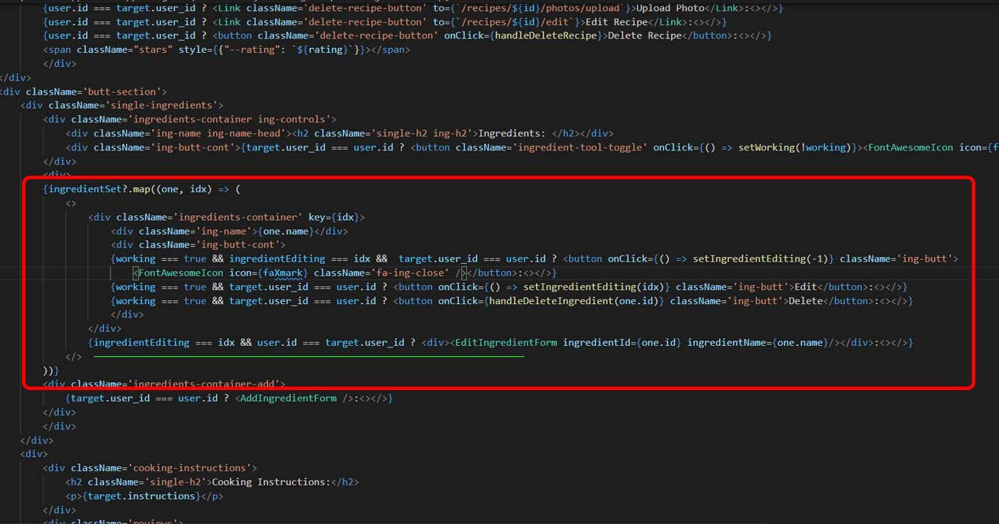
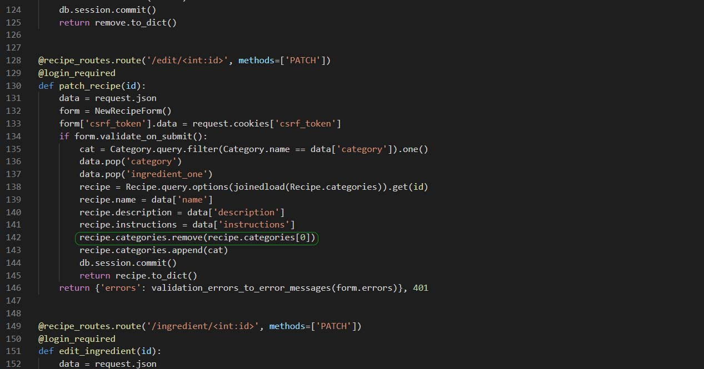

# Broke & Hangry
This is a clone of [Cooking by NY Times](https://cooking.nytimes.com/).

Where else to go get ideas for cheap eats when you are a broke college or boot camp student? Broke & Hangry, of course! Access the [Broke & Hangry MVP](https://brokehangry.herokuapp.com/).

**Broke & Hangry** is the place to go to share your budget recipes as a broke college or boot camp student.

# Index
|
[MVP Feature List](https://github.com/katsutori/capstone/wiki/MVP-Feature-List) |
[Database Schema](https://github.com/katsutori/capstone/wiki/Database-Schema) |
[API Documentation]() |
[Frontend Routes]() |

# Technologies Used


# Clone Broke & Hangry

1. Clone this repository (only this branch)

   ```bash
   git clone git@github.com:katsutori/capstone.git
   ```
2. Install dependencies

      ```bash
      pipenv install --dev -r dev-requirements.txt && pipenv install -r requirements.txt
      ```

3. Create a **.env** file based on the example with proper settings for your
   development environment
4. Setup your PostgreSQL user, password and database and make sure it matches your **.env** file

5. Get into your pipenv, migrate your database, seed your database, and run your flask app

   ```bash
   pipenv shell
   ```

   ```bash
   flask db upgrade
   ```

   ```bash
   flask seed all
   ```

   ```bash
   flask run
   ```

6. To run the React App, cd into the `react-app` directory.

   ```bash
   npm install
   ```

   ```bash
   npm start
   ```

# Features Highlight
## Interactive Recipe Page
Building an interactive site is one thing, but making it INTERACTIVE is another. Like a fine Swiss automatic watch, Broke & Hangry's individual recipe pages bring a number of complications under the hood while delivering on smooth, simple, and featureful experiences for users. Users can CRUD reviews and CRUD ingredients on the same page without having to navigate away nor refreshing. OPs also have the option to use off-page features, such as adding photos and editing the meat and potatoes of their recipes with the simple click of a button.







## Star Ratings
What's the point in having reviews if you can't display a quick one-two for users to see a recipe' s ratings? While not technically challenging, seeing stars fill out in fractions is pretty cool! Because while you might like a 4.5 stars rated recipe, a 4.9 is even better!



# Challenges Highlight
## Interactive Recipe Page
So many components. So many moving parts. When one bug is squashed, another shows up. Bugs are like roaches, except they're the developer's fault. Developing an interactive page has its challenges when your conditionals are logically flawed. Don't not logic.

Showing and hiding controls was initially a problem when using boolean triggers. Use index triggers instead when you are mapping out your components.



## PATCHING through Join Tables
Documentation is great until you cannot find them. When a PATCH requires a change to multiple tables, it was not easy. Well, it was. It just took some time to try different keyboard punches to get it to work. Remove your join then add a new one.


# Flask React Project

This is the starter for the Flask React project.

## Getting started

1. Clone this repository (only this branch)

   ```bash
   git clone https://github.com/appacademy-starters/python-project-starter.git
   ```

2. Install dependencies

      ```bash
      pipenv install --dev -r dev-requirements.txt && pipenv install -r requirements.txt
      ```

3. Create a **.env** file based on the example with proper settings for your
   development environment
4. Setup your PostgreSQL user, password and database and make sure it matches your **.env** file

5. Get into your pipenv, migrate your database, seed your database, and run your flask app

   ```bash
   pipenv shell
   ```

   ```bash
   flask db upgrade
   ```

   ```bash
   flask seed all
   ```

   ```bash
   flask run
   ```

6. To run the React App in development, checkout the [README](./react-app/README.md) inside the `react-app` directory.

***
*IMPORTANT!*
   If you add any python dependencies to your pipfiles, you'll need to regenerate your requirements.txt before deployment.
   You can do this by running:

   ```bash
   pipenv lock -r > requirements.txt
   ```

*ALSO IMPORTANT!*
   psycopg2-binary MUST remain a dev dependency because you can't install it on apline-linux.
   There is a layer in the Dockerfile that will install psycopg2 (not binary) for us.
***

## Deploy to Heroku

1. Before you deploy, don't forget to run the following command in order to
ensure that your production environment has all of your up-to-date
dependencies. You only have to run this command when you have installed new
Python packages since your last deployment, but if you aren't sure, it won't
hurt to run it again.

   ```bash
   pipenv lock -r > requirements.txt
   ```

2. Create a new project on Heroku
3. Under Resources click "Find more add-ons" and add the add on called "Heroku Postgres"
4. Install the [Heroku CLI](https://devcenter.heroku.com/articles/heroku-command-line)
5. Run

   ```bash
   heroku login
   ```

6. Login to the heroku container registry

   ```bash
   heroku container:login
   ```

7. Update the `REACT_APP_BASE_URL` variable in the Dockerfile.
   This should be the full URL of your Heroku app: i.e. "https://flask-react-aa.herokuapp.com"
8. Push your docker container to heroku from the root directory of your project.
   (If you are using an M1 mac, follow [these steps below](#for-m1-mac-users) instead, then continue on to step 9.)
   This will build the Dockerfile and push the image to your heroku container registry.

   ```bash
   heroku container:push web -a {NAME_OF_HEROKU_APP}
   ```

9. Release your docker container to heroku

      ```bash
      heroku container:release web -a {NAME_OF_HEROKU_APP}
      ```

10. set up your database

      ```bash
      heroku run -a {NAME_OF_HEROKU_APP} flask db upgrade
      heroku run -a {NAME_OF_HEROKU_APP} flask seed all
      ```

11. Under Settings find "Config Vars" and add any additional/secret .env
variables.

12. profit

### For M1 Mac users

(Replaces **Step 8**)

1. Build image with linux platform for heroku servers. Replace
{NAME_OF_HEROKU_APP} with your own tag:

   ```bash=
   docker buildx build --platform linux/amd64 -t {NAME_OF_HEROKU_APP} .
   ```

2. Tag your app with the url for your apps registry. Make sure to use the name
of your Heroku app in the url and tag name:

   ```bash=2
   docker tag {NAME_OF_HEROKU_APP} registry.heroku.com/{NAME_OF_HEROKU_APP}/web
   ```

3. Use docker to push the image to the Heroku container registry:

   ```bash=3
   docker push registry.heroku.com/{NAME_OF_HEROKU_APP}/web
   ```
